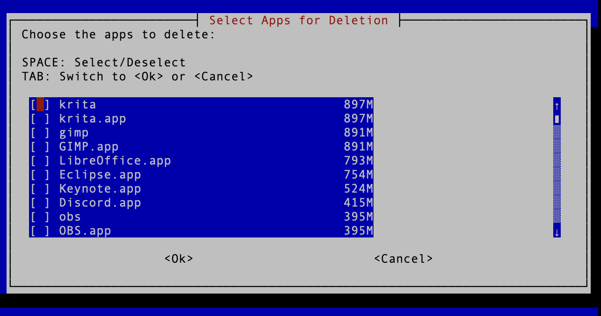

# Mac Storage Manager

The Mac Storage Manager is a shell script designed to help you manage disk space by identifying large applications on your Mac. It allows you to see the size of various installed applications, including Homebrew packages, and interactively select which ones to delete. It also provides options to delete associated caches to free up additional space.



## Features

- **Size Calculation**: The script calculates the size of:
  - Homebrew formulas (installed via `brew list --formula`)
  - Homebrew casks (installed via `brew list --cask`)
  - Applications in `/Applications` and `~/Applications` directories
  - Optionally, applications found across the entire system via `sudo find`
  - Optionally, packages installed via `pkgutil`


  
- **Interactive Deletion**: After collecting the application sizes, the script allows you to interactively select applications for deletion using a graphical dialog (whiptail).

- **Cache Deletion**: You can also choose to delete the caches of the selected applications to free up additional space.

- **Progress Bar and Sound Effects**: The script displays a progress bar during long-running tasks and provides audio feedback for key actions (e.g., when interacting with the GUI).

## How to Use

### Step 1: Clone the Repository
Clone this repository to your local machine using:

```bash
git clone https://github.com/NarekMosisian/mac-storage-manager.git
```

### Step 2: Make the Script Executable
Navigate to the cloned directory and make the script executable by running:

```bash
chmod +x ./application_size_checker.sh
```

### Step 3: Install Dependencies

The script relies on several tools. Install them via Homebrew:

```bash
brew install parallel jq newt
```

- **parallel**: Executes commands in parallel to speed up processing.
- **jq**: Parses JSON output from system commands.
- **newt**: Provides terminal-based GUI dialogs (for interactive selection and progress bars).

### Step 4: Run the Script
Run the script with the following command:

```bash
./application_size_checker.sh
```

### Step 5: Follow the Interactive Prompts

During the script's execution, you will be prompted with the following options:

1. **Include `sudo find`**: This step searches for all applications across the system but may take a long time to complete.
2. **Include `pkgutil` packages**: This step lists all packages installed via `pkgutil`, which may also take time depending on the number of installed packages.

Once the script has gathered the sizes of all applications, a graphical interface will appear, allowing you to select the applications you wish to delete. After selection, you can choose whether or not to delete the caches of these applications as well.

## Suppressing GNU Parallel Citation Notices

When running `parallel` for the first time, you might encounter a citation notice. To suppress this message, run:

```bash
parallel --citation
```

This only needs to be done once.

## Dependencies

This script relies on the following tools:

- **GNU Parallel**: A shell tool for executing jobs in parallel. [GNU Parallel](https://www.gnu.org/software/parallel/)
- **jq**: A lightweight and flexible command-line JSON processor. [jq](https://stedolan.github.io/jq/)
- **Homebrew**: A package manager for macOS. [Homebrew](https://brew.sh/)
- **newt**: A package for creating GUI dialogs in the terminal. [newt](https://pagure.io/newt)

Make sure these dependencies are installed before running the script.

## License

This project is licensed under the MIT License. See the [LICENSE](LICENSE) file for more details.
