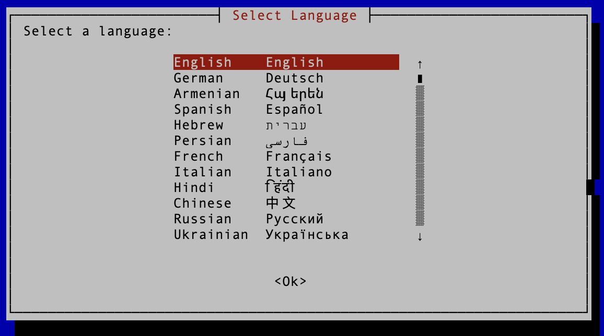

# Mac Storage Manager – Cross-Platform internationalized Version (macOS & Linux)


Mac Storage Manager is a shell script suite that helps you reclaim disk space by identifying and managing large applications on your macOS or Linux system.


---

## Table of Contents
- [Features](#features)
- [Installation and Setup](#installation-and-setup)
  - [Clone the Repository](#clone-the-repository)
  - [Make Scripts Executable](#make-scripts-executable)
  - [Install Dependencies](#install-dependencies)
- [Run the Project](#run-the-project)
- [Homebrew Support](#homebrew-support)
- [Known Limitations and Common Issues](#known-limitations-and-common-issues)
- [Dependencies](#dependencies)
- [What Exactly is Deleted](#what-exactly-is-deleted)
- [Warning](#warning)
- [Connect with me](#connect-with-me)
- [License](#license)

---

## Features

- **Enhanced Logging & Progress Feedback:**
  - Detailed logs (stored in `mac_storage_manager.log`) are generated throughout the operation.
  - Advanced error handling is provided via interactive whiptail dialogs and extensive logging.

- **Interactive Application Deletion:**
  - Applications are listed with calculated sizes (including Homebrew formulas and casks).
  - Users can select one or more apps to delete using an interactive checklist UI.
  - Confirmation dialogs present all files and associated directories that will be removed, ensuring safe deletion.

- **Cross‑Platform Application Discovery:**
  - Centralizes handling of `.app` vs. `.desktop` extensions and `APP_DIRS` for unified scanning and deletion on both macOS and Linux.

- **Package Manager Removal (Linux):**
  - Introduces `delete_via_package_manager` to detect and uninstall via apt, dnf/yum, or pacman where available.

- **Critical Application Protection:**
  - Prevents deletion of essential system apps (e.g., Finder, Safari, gnome‑terminal) to avoid accidental damage.

- **Main Menu Sound Toggle:**
  - Adds an on/off switch for audio feedback directly in the main menu, enabling quick control over sound notifications.

- **Internationalization & Localization:**
  - Translations are provided for over 40 languages, making the tool accessible worldwide.

  (Note that many language translations are experimental and may not yet be completely accurate or consistent. I welcome feedback from native speakers!)



---

## Installation and Setup

### Clone the Repository

Clone the repository to your local machine:

```bash
git clone https://github.com/NarekMosisian/mac-storage-manager.git
```

### Make Scripts Executable

After cloning, navigate to the project directory and run:

```bash
cd mac-storage-manager
chmod +x *.sh
```

### Install Dependencies

Ensure you have the following dependencies installed:

- **jq** (for JSON parsing)
- **newt/whiptail** (for interactive terminal dialogs)
- **Sound utilities:**
  - On macOS, the `afplay` command is used (usually pre‑installed).
  - On Linux, `paplay` is used (install via your package manager).

For macOS via Homebrew:

```bash
brew install jq newt
```

For Debian/Ubuntu (Linux):

```bash
sudo apt-get update
sudo apt-get install jq newt paplay
```

---

## Run the Project

Start the application by running the main entry point:

```bash
./main.sh
```

---

## Homebrew Support

A dedicated Homebrew tap is provided specifically for Mac Storage Manager. This tap ensures that the Homebrew formula is always up-to-date and error-free. You can check it out at the following link:

[**NarekMosisian/homebrew-mac-storage-manager**](https://github.com/NarekMosisian/homebrew-mac-storage-manager)


---

## Known Limitations and Common Issues

- **Performance:** Scanning the entire filesystem with `sudo find` can be slow.
- **Permissions:** Ensure you have sufficient permissions to delete system files.
- **Interactive Dialogs:** The project uses whiptail/newt; make sure they are installed correctly on your system.
- **Shell Compatibility:** It is recommended to use bash for running the scripts to ensure full compatibility.

---

## Dependencies

This script relies on the following tools:

- **jq**: A lightweight and flexible command-line JSON processor.
- **Homebrew**: (macOS only) or **Linuxbrew** (optional on Linux).
- **whiptail**: A package for creating GUI dialogs in the terminal.
- **newt**: For terminal-based GUI dialogs.

Make sure these dependencies are installed before running the script.

---

## What Exactly is Deleted

When you confirm the deletion of an application, the script attempts to thoroughly remove it by deleting:

- **Main Application Files**: 
    - **On macOS**: The application bundle from `/Applications` and `~/Applications`.
    - **On Linux**: The corresponding .desktop files from `/usr/share/applications` or `~/.local/share/` applications.

- **Homebrew Files** (macOS only):
    - Uninstalls associated Homebrew formulas and casks installed via Homebrew.

**Associated Files and Directories**:
- **macOS**:
    - **Application Support** (optional):
        - `~/Library/Application Support/<Application Name>`
        - `/Library/Application Support/<Application Name>`
    - **Preferences** (optional):
        - `~/Library/Preferences/com.<Application Name>.*`
        - `/Library/Preferences/com.<Application Name>.*`
    - **Caches** (optional):
        - `~/Library/Caches/<Application Name>`
        - `~/Library/Caches/com.<Application Name>.*`
        - `/Library/Caches/<Application Name>`
        - `/Library/Caches/com.<Application Name>.*`
    - **Logs** (optional):
        - `~/Library/Logs/<Application Name>`
        - `/Library/Logs/<Application Name>`
    - **Saved Application State** (optional):
        - `~/Library/Saved Application State/com.<Application Name>.*`
        - `/Library/Saved Application State/com.<Application Name>.*`

- **Linux**:
    - **Application Data** (optional):
        - `$XDG_DATA_HOME/<AppName>`
        - `~/.local/share/<AppName>`
    - **Configuration Files** (optional):
        - `$XDG_CONFIG_HOME/<AppName>`
        - `~/.config/<AppName>`
    - **Cache Files** (optional):
        - `$XDG_CACHE_HOME/<AppName>`
        - `~/.cache/<AppName>`
    - **Log Files** (optional):
        - Common log directories (if any) related to the application

- **Additional Files Found via `sudo find` (optional)**: Any files matching the application name found during the `sudo find` operation (if you chose to include this step). The script will display these files and ask for your confirmation before deletion.

---

## Warning

Please read the following carefully before using the script:

- **Data Loss Risk**: The script performs a thorough deletion of applications and their associated files. Be cautious when selecting applications to delete. Ensure that you do not remove essential system applications or files.
- **Review Before Deleting**: Before any files are deleted, the script will display a list of files and directories that will be removed. Please review this list carefully to avoid unintended deletions.
- **No Undo**: Deleting applications and files is permanent and cannot be undone. Consider backing up important data before proceeding.
- **Use at Your Own Risk**: The script is provided "as is," without warranty of any kind. The author is not responsible for any damage or data loss that may occur as a result of using this script.

---

## Connect with me

If you have any questions or want to discuss the project further, feel free to connect with me on [LinkedIn](https://www.linkedin.com/in/narek-mosisian-484789291/).

---

## License

This project is licensed under the **GNU Affero General Public License v3.0 (AGPLv3)**.  
This license ensures that anyone who modifies, uses, or redistributes this software—especially in a networked environment—must share the source code and any modifications under the same license.  

For detailed information, see the [LICENSE](./LICENSE) file.
