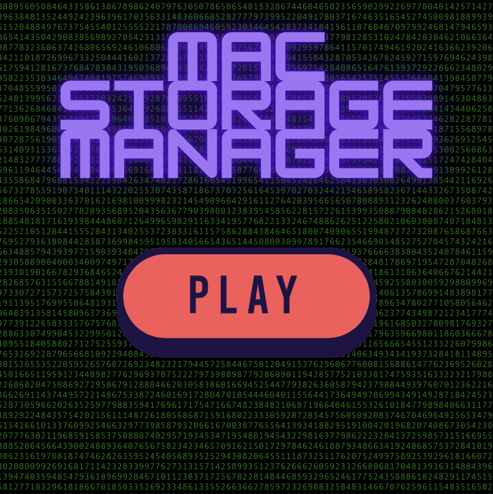

# Mac Storage Manager – Cross-Platform Version (macOS & Linux)


Mac Storage Manager is a shell script that helps you reclaim disk space by identifying and managing large applications on your system. Originally built for macOS, this new version has been refactored to work on both macOS and Linux. It calculates the size of installed applications (including Homebrew formulas and casks on macOS) and provides an interactive interface for safely deleting applications along with their associated files.


---

## Table of Contents
- [Features](#features)
- [Log File](#log-file)
- [Watch the Demo](#watch-the-demo)
- [Continuous Integration](#continuous-integration)
- [How to Use](#how-to-use)
  - [Step 1: Clone the Repository](#step-1-clone-the-repository)
  - [Step 2: Make the Script Executable](#step-2-make-the-script-executable)
  - [Step 3: Install Dependencies](#step-3-install-dependencies)
  - [Step 4: Run the Script](#step-4-run-the-script)
  - [Step 5: Follow the Interactive Prompt](#step-5-follow-the-interactive-prompt)
- [Known Limitations and Common Issues](#known-limitations-and-common-issues)
- [Dependencies](#dependencies)
- [What Exactly is Deleted](#what-exactly-is-deleted)
- [Warning](#warning)
- [Connect with me](#connect-with-me)
- [License](#license)

---

## Features

- **Cross-Platform Support**:  
  - **macOS**: Scans `/Applications` and `~/Applications` for `.app` bundles.
  - **Linux**: Scans `/usr/share/applications` and `~/.local/share/applications` for `.desktop` files.
  
- **Size Calculation**:  
  - Calculates sizes for Homebrew formulas and casks (macOS only).
  - Scans standard application directories.
  - Optionally performs a comprehensive search using `sudo find`.

- **Interactive Deletion**:  
  - Graphical dialogs using whiptail for selecting applications to delete.
  - Prompts for confirmation before deleting main files and associated files.

- **Selective Associated File Deletion**:  
  - **macOS**: Offers to remove Application Support, Preferences, Caches, Logs, and Saved Application State.
  - **Linux**: Offers to remove Application Data, Configuration, Cache, and Log files based on XDG directories.

- **Progress and Audio Feedback**:  
  - Displays progress bars during long-running tasks.
  - Plays sound effects for key actions (using `afplay` on macOS and `paplay` on Linux).

- **Logging**:  
  - Records errors and detailed process logs in `application_size_checker.log`.

## Log File

The script creates the log file `application_size_checker.log`, which records important events and error messages. In addition to error and debug messages, the log file contains the following information:

- **Timestamps**:  
  - **Script Start and End**: Timestamps are explicitly logged at the beginning and the end of the script using the `date` command.

- **Debug Information**:  
  - The sound path used by the script is logged at the start (e.g., `DEBUG: SOUND_PATH=...`).  
  - Outputs of commands like `ls -l` (for instance, the contents of the sound directory) are recorded.

- **Error Messages and Warnings**:  
  - Detailed logs are kept for errors when accessing files or deleting applications (both in the main script and when removing associated files).  
  - Notifications for failed or canceled sudo password prompts, as well as any unsuccessful Homebrew operations (e.g., during uninstallation), are logged.

- **Progress Updates**:  
  - During long-running operations (e.g., searching for applications, calculating sizes, or deleting files), progress updates and the corresponding process steps (e.g., "Deleting...", "Running 'sudo find'...") are recorded in the log file.

This comprehensive logging provides a complete overview of the script's execution and helps you pinpoint where the process may have failed in case any issues occur.

## Watch the Demo

<a href="https://www.youtube.com/watch?v=eO7GkXesK0Q&ab_channel=NarekMosisian">
    
</a>

> **Tip:** Hold down Ctrl (Windows/Linux) or Cmd (Mac) and click the image to open the video in a new tab.

Click the image to watch the demo video on YouTube.

## Continuous Integration

This project uses GitHub Actions for continuous integration. Every push and pull request to the `main` branch triggers a workflow that:
- Updates Homebrew (ignoring non-critical warnings)
- Installs dependencies (jq, newt)
- **Taps the external Homebrew repository** ([NarekMosisian/mac-storage-manager](https://github.com/NarekMosisian/homebrew-mac-storage-manager))
- Installs the `mac-storage-manager` formula
- Runs tests (using `brew test mac-storage-manager`)
- Performs a strict audit of the formula

You can view the current CI status using the badge at the top.

---

**Note:** A Homebrew tap for Mac Storage Manager is available. Check it out at [NarekMosisian/homebrew-mac-storage-manager](https://github.com/NarekMosisian/homebrew-mac-storage-manager). This tap includes its own CI configuration to ensure the formula is always up-to-date and error-free.

---

## How to Use

### Step 1: Clone the Repository

Clone the repository to your local machine:

```bash
git clone https://github.com/NarekMosisian/mac-storage-manager.git
```

### Step 2: Make the Script Executable

Navigate to the cloned directory and make the script executable by running:

```bash
chmod +x ./application_size_checker.sh
```

### Step 3: Install Dependencies

The script relies on several tools. Install them as follows:

- **macOS** (using Homebrew):

```bash
brew install jq newt
```

- **Linux** (using your package manager or Linuxbrew):

```bash
# On Debian/Ubuntu-based systems:
sudo apt-get update
sudo apt-get install jq newt paplay

# Alternatively, if using Linuxbrew:
brew install jq newt
```
Note: On macOS, afplay is used for audio, while on Linux paplay is used.

    jq: Parses JSON output from system commands.
    newt: Provides terminal-based GUI dialogs (for interactive selection and progress bars).

### Step 4: Run the Script

Launch the script by executing:

```bash
./application_size_checker.sh
```

Or, explicitly with zsh:

```bash
zsh ./application_size_checker.sh
```

Note: The script uses zsh. Ensure that zsh is installed and set as your default shell, or run the script explicitly with zsh:

```bash
zsh ./application_size_checker.sh
```

### Step 5: Follow the Interactive Prompt

During the script's execution, you will be prompted with the following option:

    Include sudo find: This step searches for all applications across the system but may take a long time to complete.

Once the script has gathered the sizes of all applications, a graphical interface will appear, allowing you to select the applications you wish to delete. After selection, the script will:

    Prompt for confirmation before deleting each application and its associated files.
    Display the list of files and directories that will be removed for each application.
    Prompt you for each category of associated files (Application Support, Preferences, Caches, Logs, Saved Application State) whether you want to delete them.
    Optionally delete any additional files found via sudo find that are associated with the application.

## Known Limitations and Common Issues

- **Performance**: Searching the entire system with sudo find can be time-consuming and may strain system resources.
- **Permissions**: Ensure you have the necessary permissions to uninstall applications and delete files.
- **Security Warning**: Be cautious when deleting applications and files to avoid data loss.
- **Shell Compatibility**: The script is written for zsh. Ensure you have zsh installed.

## Dependencies

This script relies on the following tools:

- **jq**: A lightweight and flexible command-line JSON processor.
- **Homebrew**: (macOS only) or **Linuxbrew** (optional on Linux).
- **whiptail**: A package for creating GUI dialogs in the terminal.
- **newt**: For terminal-based GUI dialogs.

Make sure these dependencies are installed before running the script.

## What Exactly is Deleted

When you confirm the deletion of an application, the script attempts to thoroughly remove it by deleting:

- **Main Application Files**: 
    - **On macOS**: The application bundle from `/Applications` and `~/Applications`.
    - **On Linux**: The corresponding .desktop files from /usr/share/applications or ~/.local/share/applications.

- **Homebrew Files** (macOS only):
    - Uninstalls associated Homebrew formulas and casks installed via Homebrew.

**Associated Files and Directories**:
- **macOS**:
    - **Application Support** (optional):
        - `~/Library/Application Support/<Application Name>`
        - `/Library/Application Support/<Application Name>`
    - **Preferences** (optional):
        - `~/Library/Preferences/com.<Application Name>.*`
        - `/Library/Preferences/com.<Application Name>.*`
    - **Caches** (optional):
        - `~/Library/Caches/<Application Name>`
        - `~/Library/Caches/com.<Application Name>.*`
        - `/Library/Caches/<Application Name>`
        - `/Library/Caches/com.<Application Name>.*`
    - **Logs** (optional):
        - `~/Library/Logs/<Application Name>`
        - `/Library/Logs/<Application Name>`
    - **Saved Application State** (optional):
        - `~/Library/Saved Application State/com.<Application Name>.*`
        - `/Library/Saved Application State/com.<Application Name>.*`

- **Linux**:
    - **Application Data** (optional):
        - `$XDG_DATA_HOME/<AppName>`
        - `~/.local/share/<AppName>`
    - **Configuration Files** (optional):
        - `$XDG_CONFIG_HOME/<AppName>`
        - `~/.config/<AppName>`
    - **Cache Files** (optional):
        - `$XDG_CACHE_HOME/<AppName>`
        - `~/.cache/<AppName>`
    - **Log Files** (optional):
        - Common log directories (if any) related to the application

- **Additional Files Found via `sudo find` (optional)**: Any files matching the application name found during the `sudo find` operation (if you chose to include this step). The script will display these files and ask for your confirmation before deletion.

## Warning

Please read the following carefully before using the script:

- **Data Loss Risk**: The script performs a thorough deletion of applications and their associated files. Be cautious when selecting applications to delete. Ensure that you do not remove essential system applications or files.
- **Review Before Deleting**: Before any files are deleted, the script will display a list of files and directories that will be removed. Please review this list carefully to avoid unintended deletions.
- **No Undo**: Deleting applications and files is permanent and cannot be undone. Consider backing up important data before proceeding.
- **Use at Your Own Risk**: The script is provided "as is," without warranty of any kind. The author is not responsible for any damage or data loss that may occur as a result of using this script.

## Connect with me

If you have any questions or want to discuss the project further, feel free to connect with me on [LinkedIn](https://www.linkedin.com/in/narek-mosisian-484789291/).

## License

This project is licensed under the **GNU Affero General Public License v3.0 (AGPLv3)**.  
This license ensures that anyone who modifies, uses, or redistributes this software—especially in a networked environment—must share the source code and any modifications under the same license.  

For detailed information, see the [LICENSE](./LICENSE) file.
