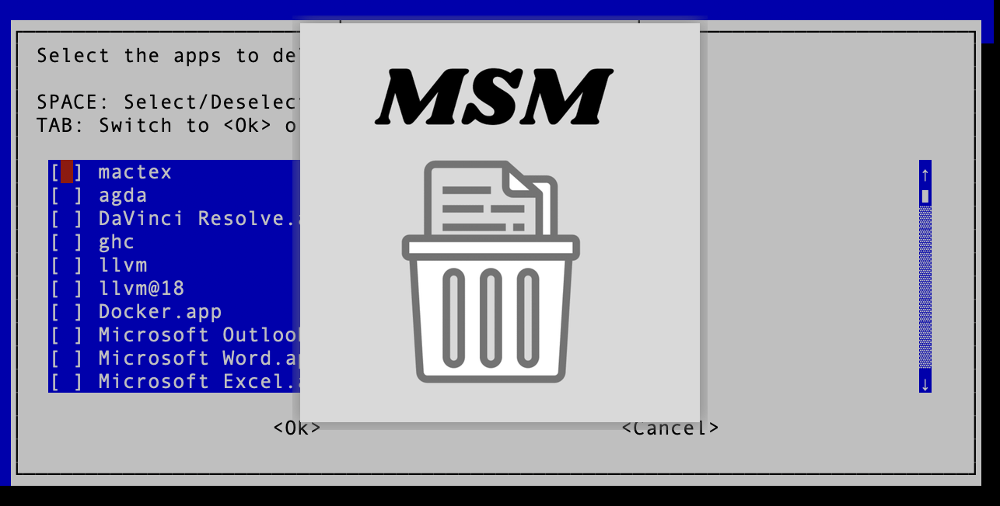

# Mac Storage Manager – Cross-Platform internationalized Version (macOS & Linux)


Mac Storage Manager is now a fully modularized shell script suite that helps you reclaim disk space by identifying and managing large applications on your system. Originally created for macOS, this new version has been completely refactored and expanded for cross‑platform support on both macOS and Linux, and is now split into nine modular .sh files for improved maintainability, extensibility, and clarity.



---

## Table of Contents
- [Features](#features)
- [Project Structure](#project-structure)
- [Installation and Setup](#installation-and-setup)
  - [Clone the Repository](#clone-the-repository)
  - [Make Scripts Executable](#make-scripts-executable)
  - [Install Dependencies](#install-dependencies)
- [How to Use](#how-to-use)
  - [Run the Project](#run-the-project)
  - [Interactive Language Selection](#interactive-language-selection)
- [Logging and Sudo Handling](#logging-and-sudo-handling)
- [Internationalization & Translations](#internationalization--translations)
- [Homebrew Support](#homebrew-support)
- [Continuous Integration](#continuous-integration)
- [Known Limitations and Common Issues](#known-limitations-and-common-issues)
- [Dependencies](#dependencies)
- [What Exactly is Deleted](#what-exactly-is-deleted)
- [Warning](#warning)
- [Connect with me](#connect-with-me)
- [License](#license)

---

## Features

- **Cross-Platform Compatibility:**
  - Scans standard application directories on both macOS and Linux.
  - Supports Homebrew formulas and casks on macOS.
  - Optionally performs a comprehensive system search using `sudo find`.

- **Modular Design:**
  - The project is now divided into 9 distinct shell scripts:
    - **main.sh:** Entry point; sources all other modules.
    - **deletion.sh:** Contains functions for uninstallation and deletion of applications.
    - **menu.sh:** Implements the interactive user interface and main menu.
    - **logging.sh:** Records process events, errors, and debugging information.
    - **sudo_utils.sh:** Manages sudo authentication and command execution with privileges.
    - **size_calculations.sh:** Calculates application sizes from various sources.
    - **translations.sh:** Provides full internationalization (i18n) support with over 40 languages.
    - **config.sh:** Manages configuration variables including language settings.
    - **sound.sh:** Plays OS‑dependent sound feedback using either `afplay` (macOS) or `paplay` (Linux).
  - This new modular architecture makes the project easier to maintain and extend.

- **Enhanced Logging & Progress Feedback:**
  - Detailed logs (stored in `application_size_checker.log`) are generated throughout the operation.
  - A dynamic progress gauge is displayed during long‑running operations.
  - Advanced error handling is provided via interactive whiptail dialogs and extensive logging.

- **Interactive Application Deletion:**
  - Applications are listed with calculated sizes (including Homebrew formulas and casks).
  - Users can select one or more apps to delete using an interactive checklist UI.
  - Confirmation dialogs present all files and associated directories that will be removed, ensuring safe deletion.

- **Internationalization & Localization:**
  - A comprehensive translations module is integrated to render user‑facing strings in the user’s preferred language.
  - The user can change the language dynamically through the language selection menu.
  - Translations are provided for over 40 languages, making the tool accessible worldwide.

---

## Project Structure

```plaintext
/mac-storage-manager
│
├── config.sh              # Contains configuration variables and language settings
├── deletion.sh            # Functions for uninstalling/deleting applications
├── logging.sh             # Functions for logging, progress updates, and log file reconstruction
├── main.sh                # Main entry point; sources all modules and starts the program
├── menu.sh                # Implements interactive UI menus and language selection
├── size_calculations.sh   # Functions for calculating/formatting application sizes
├── sound.sh               # Functions for playing sound effects based on the operating system
├── sudo_utils.sh          # Contains sudo authentication and execution with root privileges
├── translations.sh        # Multilingual translations and helper functions
└── README.md              # This file
```

---

## Installation and Setup

### Clone the Repository

Clone the repository to your local machine:

```bash
git clone https://github.com/NarekMosisian/mac-storage-manager.git
```

### Make Scripts Executable

After cloning, navigate to the project directory and run:

```bash
cd mac-storage-manager
chmod +x *.sh
```

### Install Dependencies

Ensure you have the following dependencies installed:

- **jq** (for JSON parsing)
- **newt/whiptail** (for interactive terminal dialogs)
- **Sound utilities:**
  - On macOS, the `afplay` command is used (usually pre‑installed).
  - On Linux, `paplay` is used (install via your package manager).

For macOS via Homebrew:

```bash
brew install jq newt
```

For Debian/Ubuntu (Linux):

```bash
sudo apt-get update
sudo apt-get install jq newt paplay
```

---

## How to Use

### Run the Project

Start the application by running the main entry point:

```bash
./main.sh
```

This script loads all modules, handles the language selection, and presents an interactive menu for scanning, selecting, and deleting applications.

### Interactive Language Selection

- Upon startup or via the main menu, you can select your preferred language.
- The entire interface (dialogs, messages, and instructions) will be rendered in your chosen language.
- This language selection persists across sessions.

---

## Logging and Sudo Handling

- Detailed logs are written to `mac_storage_manager.log` to capture every event and error.
- Sudo handling is robust:
  - Prompts for the sudo password when required.
  - Validates and caches the sudo password for use in later commands.
  - Retries up to three times before exiting on failure.

---

## Internationalization & Translations

- The `translations.sh` module includes all user‑visible strings in over 40 languages.
- Use helper functions (e.g., `get_text`, `get_yes_button`, `get_no_button`, etc.) to retrieve localized strings.
- Easily add new languages or update existing translations as needed.

---

## Homebrew Support

- For macOS users, the script fully integrates with Homebrew:
  - It calculates sizes for both Homebrew formulas and casks.
  - It can uninstall applications using Homebrew commands if they were installed via Homebrew.
  - Special handling is provided for applications like Docker.
  - A dedicated Homebrew tap is provided specifically for Mac Storage Manager. This tap ensures that the Homebrew formula is always up-to-date and error-free. You can check it out at the following link:

[**NarekMosisian/homebrew-mac-storage-manager**](https://github.com/NarekMosisian/homebrew-mac-storage-manager)


---

## Continuous Integration

- The project uses GitHub Actions for continuous integration.
- Every push and pull request triggers tests that:
  - Ensure dependencies are installed,
  - Validate Homebrew formula integrity,
  - And test the functionality of the modular scripts.
- Check the status badge at the top of this README for current CI status.

---

## Known Limitations and Common Issues

- **Performance:** Scanning the entire filesystem with `sudo find` can be slow.
- **Permissions:** Ensure you have sufficient permissions to delete system files.
- **Interactive Dialogs:** The project uses whiptail/newt; make sure they are installed correctly on your system.
- **Shell Compatibility:** It is recommended to use bash for running the scripts to ensure full compatibility.

---

## Dependencies

This script relies on the following tools:

- **jq**: A lightweight and flexible command-line JSON processor.
- **Homebrew**: (macOS only) or **Linuxbrew** (optional on Linux).
- **whiptail**: A package for creating GUI dialogs in the terminal.
- **newt**: For terminal-based GUI dialogs.

Make sure these dependencies are installed before running the script.

---

## What Exactly is Deleted

When you confirm the deletion of an application, the script attempts to thoroughly remove it by deleting:

- **Main Application Files**: 
    - **On macOS**: The application bundle from `/Applications` and `~/Applications`.
    - **On Linux**: The corresponding .desktop files from `/usr/share/applications` or `~/.local/share/` applications.

- **Homebrew Files** (macOS only):
    - Uninstalls associated Homebrew formulas and casks installed via Homebrew.

**Associated Files and Directories**:
- **macOS**:
    - **Application Support** (optional):
        - `~/Library/Application Support/<Application Name>`
        - `/Library/Application Support/<Application Name>`
    - **Preferences** (optional):
        - `~/Library/Preferences/com.<Application Name>.*`
        - `/Library/Preferences/com.<Application Name>.*`
    - **Caches** (optional):
        - `~/Library/Caches/<Application Name>`
        - `~/Library/Caches/com.<Application Name>.*`
        - `/Library/Caches/<Application Name>`
        - `/Library/Caches/com.<Application Name>.*`
    - **Logs** (optional):
        - `~/Library/Logs/<Application Name>`
        - `/Library/Logs/<Application Name>`
    - **Saved Application State** (optional):
        - `~/Library/Saved Application State/com.<Application Name>.*`
        - `/Library/Saved Application State/com.<Application Name>.*`

- **Linux**:
    - **Application Data** (optional):
        - `$XDG_DATA_HOME/<AppName>`
        - `~/.local/share/<AppName>`
    - **Configuration Files** (optional):
        - `$XDG_CONFIG_HOME/<AppName>`
        - `~/.config/<AppName>`
    - **Cache Files** (optional):
        - `$XDG_CACHE_HOME/<AppName>`
        - `~/.cache/<AppName>`
    - **Log Files** (optional):
        - Common log directories (if any) related to the application

- **Additional Files Found via `sudo find` (optional)**: Any files matching the application name found during the `sudo find` operation (if you chose to include this step). The script will display these files and ask for your confirmation before deletion.

---

## Warning

Please read the following carefully before using the script:

- **Data Loss Risk**: The script performs a thorough deletion of applications and their associated files. Be cautious when selecting applications to delete. Ensure that you do not remove essential system applications or files.
- **Review Before Deleting**: Before any files are deleted, the script will display a list of files and directories that will be removed. Please review this list carefully to avoid unintended deletions.
- **No Undo**: Deleting applications and files is permanent and cannot be undone. Consider backing up important data before proceeding.
- **Use at Your Own Risk**: The script is provided "as is," without warranty of any kind. The author is not responsible for any damage or data loss that may occur as a result of using this script.

---

## Connect with me

If you have any questions or want to discuss the project further, feel free to connect with me on [LinkedIn](https://www.linkedin.com/in/narek-mosisian-484789291/).

---

## License

This project is licensed under the **GNU Affero General Public License v3.0 (AGPLv3)**.  
This license ensures that anyone who modifies, uses, or redistributes this software—especially in a networked environment—must share the source code and any modifications under the same license.  

For detailed information, see the [LICENSE](./LICENSE) file.

---

Enjoy your new, modular, and fully internationalized Mac Storage Manager!
